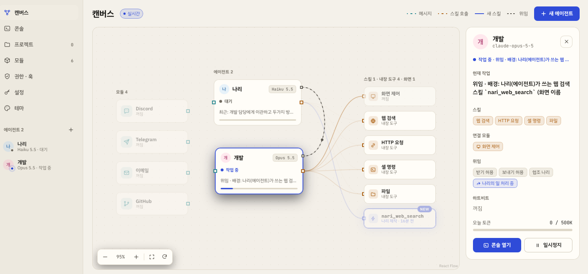
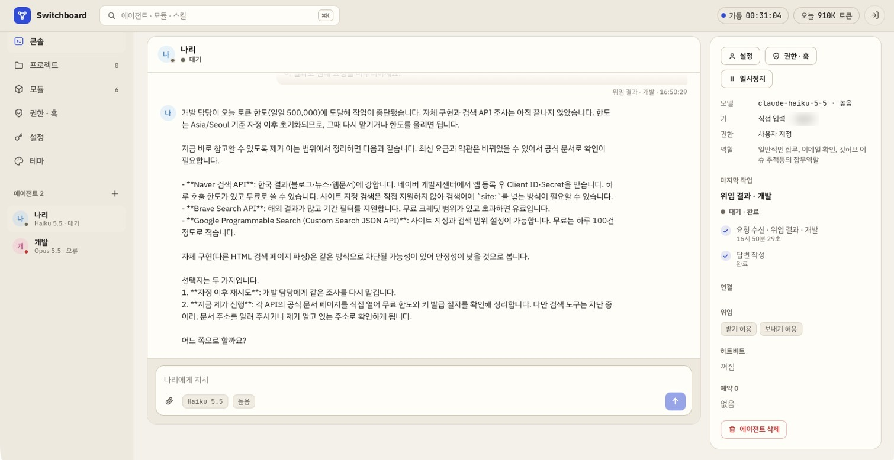

# Switchboard

[](LICENSE)

24시간 돌아가는 Claude 에이전트 서버입니다. 에이전트 · 모듈 · 스킬이 어떻게 이어져 있고 지금 무엇을 하는지 카드와 선으로 한눈에 보고,
권한과 훅으로 안전하게 운영합니다.



- **에이전트 여러 명** — 같은 모델로 여러 에이전트를 두고 각각 이름 · 색 · 역할을 정합니다.
- **모델은 고르기만** — API 키를 확인하면 그 키로 쓸 수 있는 모델 목록이 나옵니다. 모델 이름을 직접 입력하지 않습니다.
- **캔버스** — 모듈 → 에이전트 → 스킬 연결, 메시지와 스킬 호출 흐름, 에이전트가 새로 만든 스킬을 실시간으로 보여 줍니다.
- **콘솔** — 지시, 실시간 답변, 도구 호출 카드, 승인 요청, 새 스킬 카드.
- **모듈** — Discord · Telegram · 이메일 · GitHub 기본 제공. Git · zip · 템플릿으로 설치하거나 에이전트에게 만들어 달라고 요청합니다. 설치 전 정적 검사와 라이선스 점검을 거칩니다.
- **스스로 일하기** — 하트비트(정해진 간격으로 스스로 점검)와 모듈 자동 알림(새 메일 등)은 알릴 것이 있을 때만 보고하고, 없으면 아무 흔적도 남기지 않습니다.
- **위임** — 에이전트끼리 일을 맡기고 결과를 돌려받습니다. 역할과 할 수 있는 일(권한 · 폴더 · 도구)을 보고 맞는 에이전트에게 맡기고, 권한에 막힌 일은 그 일을 할 수 있는 에이전트에게 넘깁니다.
- **허용 폴더** — 작업 폴더 밖에서 에이전트가 쓸 폴더를 사용자가 정합니다 (읽기만 / 읽기·쓰기). 하트비트 · 예약 실행으로 주기적으로 관리하게 할 수 있습니다.
- **프로젝트** — 에이전트가 사용자 지시나 스스로 맡아 관리하는 폴더가 어디 있는지, git 상태와 최근 활동을 한 화면에서 봅니다.
- **설정** — Anthropic 키 · 모듈 설정(봇 토큰, 메일 계정) · 훅 값은 화면에서 넣어 DB 에 암호화해 두고, `.env` 에는 서버를 띄우는 값만 둡니다.
- **화면 제어** — 에이전트가 이 컴퓨터의 화면을 보고 마우스 · 키보드로 조작합니다 (기본 꺼짐, macOS · Linux X11).
- **권한 · 훅** — 항목별 허용 / 확인 / 차단과 허용 범위, 끌 수 없는 기본 금지 조항 10개, 화면에서 만드는 규칙 훅, 파일로 쓰는 코드 훅.
- **테마** — 기본 테마 5개, 색 토큰 편집과 대비 검사, JSON 가져오기 · 내보내기.



## 빠른 시작

필요한 것: Node.js 22.18 이상 (TypeScript 직접 실행 · node:sqlite · 권한 모델), git (Git 저장소에서 모듈을 설치할 때)

```bash
git clone https://github.com/wlzerd/switchboard.git
cd switchboard
npm install
cp .env.example .env
```

`.env` 에서 아래 세 값은 꼭 채웁니다. 비어 있거나 형식이 틀리면 서버가 어떤 값이 왜 잘못됐는지 알려 주고 멈춥니다.

| 변수 | 값 |
|---|---|
| `ADMIN_PASSWORD` | 관리자 비밀번호 (12자 이상) |
| `SESSION_SECRET` | `openssl rand -hex 32` 결과 (32자 이상) |
| `SECRETS_KEY` | `openssl rand -base64 32` 결과 (화면에서 입력한 API 키 · 모듈 비밀값을 암호화) |
| `ANTHROPIC_API_KEY` | 선택. 넣어 두면 에이전트를 만들 때 ".env 기본 키"로 고를 수 있습니다 |

실행:

```bash
npm run build
npm start
```

브라우저에서 `http://<서버 주소>:8787` 을 열고 관리자 비밀번호로 로그인합니다.

개발 모드 (서버 자동 재시작 + 화면 즉시 반영, 화면은 `http://localhost:5173`):

```bash
npm run dev
```

## 어디서든 접속하기

서버는 로그인이 필요하지만, 인터넷에 열 때는 **반드시 HTTPS** 뒤에 둡니다. 셋 중 하나를 고르세요.

**Cloudflare Tunnel** — 포트를 열지 않고 공개 주소를 받습니다.

```bash
cloudflared tunnel --url http://localhost:8787
```

**Tailscale** — 내 기기들끼리만 접속합니다. 서버와 휴대폰에 Tailscale 을 켜고 `http://<tailnet 이름>:8787` 로 접속합니다.
HTTPS 가 필요하면 `tailscale serve --bg 8787` 을 씁니다.

**리버스 프록시 (Caddy)** — 도메인이 있을 때. 인증서는 Caddy 가 자동으로 받습니다.

```
agents.example.com {
    reverse_proxy 127.0.0.1:8787
}
```

프록시나 터널 뒤에서 실행할 때는 `.env` 를 이렇게 바꿉니다.

```
HOST=127.0.0.1                         # 프록시만 서버에 붙도록
PUBLIC_URL=https://agents.example.com  # 쿠키에 Secure 가 붙습니다
TRUST_PROXY=loopback                   # 같은 컴퓨터의 프록시만 믿어, 로그인 제한이 실제 접속 IP 로 동작하도록
```

프록시가 다른 컴퓨터에 있으면 `TRUST_PROXY` 에 그 IP 나 대역을 쉼표로 적습니다 (예: `10.0.0.5,192.168.1.0/24`).
`true` 는 모든 주소를 믿기 때문에 누구나 `X-Forwarded-For` 로 접속 주소를 꾸며 로그인 잠금을 피할 수 있어 권하지 않습니다 (켜면 시작할 때 경고를 남깁니다).

실시간 화면은 WebSocket(`/api/ws`)을 씁니다. Caddy · Cloudflare Tunnel 은 그대로 되고, Nginx 는 `Upgrade` 헤더를 넘겨야 합니다.

```nginx
location / {
    proxy_pass http://127.0.0.1:8787;
    proxy_http_version 1.1;
    proxy_set_header Upgrade $http_upgrade;
    proxy_set_header Connection "upgrade";
    proxy_set_header Host $host;
    proxy_set_header X-Forwarded-For $proxy_add_x_forwarded_for;
    proxy_set_header X-Forwarded-Proto $scheme;
}
```

## 24시간 실행

서버가 꺼지거나 컴퓨터가 다시 켜져도 돌아오도록 서비스로 등록합니다 (Linux systemd 예시).

```ini
# /etc/systemd/system/switchboard.service
[Unit]
Description=Switchboard
After=network-online.target
Wants=network-online.target

[Service]
WorkingDirectory=/opt/switchboard
ExecStart=/usr/bin/node server/dist/index.js
Restart=always
RestartSec=5
User=switchboard
Environment=NODE_ENV=production

[Install]
WantedBy=multi-user.target
```

```bash
sudo systemctl enable --now switchboard
```

서버는 종료 신호를 받으면 진행 중인 작업을 정리하고 모듈 프로세스를 내린 뒤 끝납니다. 모듈 프로세스가 비정상 종료되면 다시 띄우고,
짧은 시간에 반복되면 멈추고 이유를 모듈 화면에 보여 줍니다 (`MODULE_RESTART_MAX`, `MODULE_RESTART_WINDOW_MINUTES`).

## 설정

설정은 두 곳에 나눠 둡니다. 코드에 하드코딩된 주소 · 키 · 포트는 없습니다.

| 어디 | 무엇 | 바꾸는 법 |
|---|---|---|
| `.env` | 서버를 띄우는 데 필요한 값: 로그인 비밀, 암호화 키, 주소 · 포트, 서버 전체 한도 | 파일을 고치고 서버를 다시 시작 (`.env.example` 에 기본값과 설명) |
| DB (`DATA_DIR`) | Anthropic 키, 모듈 설정(봇 토큰 · 메일 계정 · 화면 제어 값), 훅 값(`$env:이름`) | 웹의 설정 화면. 모듈 설정을 저장하면 켜져 있는 그 모듈을 바로 다시 시작 |

- 비밀값(키 · 토큰 · 비밀번호)은 `SECRETS_KEY` 로 AES-256-GCM 암호화해 저장하고, 화면에는 끝 4자리만 보입니다.
  모듈 프로세스에는 그 모듈이 `module.json` 에 선언한 값만 풀어서 넘깁니다.
- 예전처럼 `.env` 에 적어 둔 모듈 설정 · 훅 값도 읽지만 설정 화면(DB)에 넣은 값이 먼저입니다.
  설정 화면에서 `.env` 에만 있는 값을 DB 로 옮긴 뒤 `.env` 에서 지우면 됩니다.
- `SECRETS_KEY` 를 바꾸면 이미 저장한 비밀값을 풀 수 없습니다. 설정 화면에 "풀 수 없음"으로 보이면 다시 넣습니다.
- 설정 화면의 `.env` 묶음은 읽기 전용입니다. 비밀값은 값 대신 "설정됨"만 보입니다.
- `.env` 와 `data/` 는 `.gitignore` 에 들어 있어 커밋되지 않습니다.

| `.env` 묶음 | 주요 변수 |
|---|---|
| 서버 | `HOST` `PORT` `PUBLIC_URL` `TRUST_PROXY` `TZ` `LOG_LEVEL` |
| 로그인 | `ADMIN_PASSWORD` `SESSION_SECRET` `SESSION_TTL_HOURS` `LOGIN_MAX_ATTEMPTS` `LOGIN_LOCK_MINUTES` |
| 저장소 | `DATA_DIR` `SECRETS_KEY` |
| Anthropic | `ANTHROPIC_API_KEY`(선택) `ANTHROPIC_BASE_URL` `AGENT_MAX_TOKENS` `AGENT_COMPACTION` `ANTHROPIC_REFUSAL_FALLBACK` |
| 실행 | `AGENT_MAX_CONCURRENCY` `AGENT_QUEUE_MAX` `APPROVAL_TIMEOUT_MINUTES` `SHELL_TIMEOUT_MS` `HTTP_TOOL_TIMEOUT_MS` `ACTIVITY_KEEP` `ATTACHMENT_MAX_MB` `ATTACHMENTS_PER_MESSAGE` |
| 스스로 일하기 | `HEARTBEAT_MIN_MINUTES` `DELEGATION_MAX_DEPTH` `DELEGATION_MAX_ROUNDS` |
| 모듈 | `MODULE_SANDBOX` `MODULE_CALL_TIMEOUT_MS` `MODULE_IDLE_TIMEOUT_MS` `GIT_BIN` |
| 기본 금지 조항 | `GUARD_FLOOD_PER_MINUTE` `GUARD_LOOP_REPEAT` |

권한 프리셋은 `config/presets.json`, 기본 금지 조항의 목록(금융 API 도메인, 비밀 파일 이름 등)은 `config/guards.json`,
기본 테마는 `config/themes.json` 에서 바꿀 수 있습니다.

## 구조

```
server/     Fastify API · SQLite(node:sqlite) · 에이전트 실행 · 모듈 호스트 · 훅 엔진
web/        React 화면 (캔버스는 React Flow)
modules/    기본 모듈 (discord, telegram, email, computer)
templates/  모듈 템플릿 (blank, webhook, watch)
config/     권한 프리셋 · 기본 금지 조항 목록 · 테마
docs/       모듈 제작 가이드 · 서드파티 라이선스 · README 화면 이미지
scripts/    개발 실행 · 라이선스 점검
```

```
 채널 모듈 ──메시지──▶ 에이전트 ──도구 호출──▶ 내장 도구 · 모듈 도구 · 스킬
 (Discord 등)           │  ▲                       │
                        │  └── 훅 · 권한 · 승인 ◀───┘
                        ▼
                  Claude Messages API (스트리밍, 적응형 사고, 서버 측 요약)
```

- 에이전트마다 작업 대기열이 있고, 같은 대화는 순서대로, 서로 다른 대화는 동시에 처리합니다 (`AGENT_MAX_CONCURRENCY` 안에서).
  대기열은 `AGENT_QUEUE_MAX` 까지만 쌓입니다. 넘치면 새 작업을 받지 않고 이유를 알리며, 채널 메시지는 활동 기록에 남기고 버립니다.
  예약 실행은 일시정지 중이거나 이전 실행이 아직 끝나지 않았으면 쌓지 않고 건너뛴 횟수만 셉니다.
- 모델 기능(노력 수준, 적응형 사고, 서버 측 요약, 웹 검색)은 모델 목록 API 가 알려 주는 대로 켭니다.
- 대화 기록과 작업 단계는 `DATA_DIR` 의 SQLite 에 저장되어 서버를 다시 켜도 남습니다.

## 안전 장치

**권한** — 에이전트마다 항목별로 정합니다.

| 모드 | 동작 |
|---|---|
| 허용 | 허용 범위(경로 · 명령 · 도메인 · 대상 패턴)가 비어 있으면 전부, 있으면 범위 안만 허용. 범위 밖은 확인으로 넘어감 |
| 확인 | 실행 전에 승인을 요청. "항상 허용"을 누른 대상은 다음부터 묻지 않음 |
| 차단 | 실행하지 않음 |

비밀 파일 읽기와 자기 권한 · 훅 변경은 잠긴 항목이라 항상 차단입니다.

**한도** — 일일 토큰 · 작업당 단계 · 동시 작업 · 분당 메시지 한도는 에이전트 설정 창에서 에이전트마다 정합니다
(처음 값은 고용할 때 고른 권한 프리셋을 따름). 일일 토큰은 0 이면 무제한이고, 그 밖에는 1,000 이상이며 위쪽 제한은 없습니다.
한도에 닿으면 새 요청을 멈추고 이유와 바꿀 곳을 남깁니다.

**기본 금지 조항** (끌 수 없음): 비밀값 유출, 비밀 파일 접근, 위험 명령, 권한 상승, 작업 폴더 탈출, 자기 권한 · 훅 변경,
하드코딩된 비밀값 설치, 금융 거래, 대량 발송, 무한 반복.

**규칙 훅** — 권한 · 훅 화면에서 만듭니다. 이벤트(도구 실행 전 · 후, 메시지 보내기 전, 메시지 받을 때, 모듈 설치 전),
조건(같음 · 포함 · 정규식 · 시간대 …), 동작(차단 · 확인 · 수정 · 기록)과 문구를 고르고, 예시 입력으로 바로 시험합니다.
조건 값에 `$env:이름` 을 쓰면 설정 화면의 훅 값(없으면 `.env` 의 같은 이름)을 참조합니다 (예: `$env:QUIET_HOURS`).
정규식 조건은 역참조 · 앞 보기처럼 입력에 따라 끝없이 느려질 수 있는 문법을 받지 않고, 시간 안에 끝나지 않으면 조건이 맞는 것으로 봅니다
(차단 훅이 시간 초과로 풀리지 않게). 수정 훅의 패턴이 시간 안에 끝나지 않으면 그 동작을 막습니다.

**코드 훅** — `DATA_DIR/hooks/*.mjs` 에 직접 씁니다. 규칙 훅의 "코드 보기"를 그대로 저장해도 같은 동작을 합니다.

```js
// DATA_DIR/hooks/quiet-shell.mjs
export default {
  name: '야간 셸 명령 확인',
  on: 'before_tool',
  action: 'ask',
  when: (ctx, h) => h.field('category') === 'shell.exec' && h.inWindow(h.env('QUIET_HOURS')),
  reason: '업무 시간 외 셸 명령({command})은 승인이 필요합니다',
};
```

`h.field(이름)` · `h.env(이름)` · `h.inWindow('HH:MM-HH:MM')` · `h.matches(이름, 정규식)` · `h.clock()` 을 쓸 수 있고,
`reason` 문자열의 `{필드}` 는 실제 값으로 바뀝니다. 파일을 고친 뒤 권한 · 훅 화면에서 "코드 훅 다시 읽기"를 누릅니다.
평가 순서는 기본 금지 조항 → 규칙 훅 → 코드 훅이며, 하나라도 차단하면 즉시 차단합니다.

**모듈 격리** — 모듈마다 별도 프로세스로 실행합니다.

- 모듈이 module.json 에 선언한 설정만 환경 변수로 전달합니다 (설정 화면 값, 없으면 `.env`. Anthropic 키 같은 서버 비밀값은 없음).
- Node 권한 모델로 파일 읽기는 모듈 폴더와 데이터 폴더, 쓰기는 데이터 폴더만 허용하고 하위 프로세스는 선언했을 때만 허용합니다.
- 모듈의 `fetch` 는 선언한 도메인만 접속됩니다. `net` · `tls` 같은 저수준 소켓은 Node 권한 모델이 막지 않으므로 정적 검사에서 경고로 보여 줍니다
  (기본 이메일 모듈은 IMAP 서버 주소를 설정으로 정하므로 "모든 주소"를 선언합니다). 서버 쪽 HTTP 도구는 사설 IP 와 리다이렉트를 다시 검사합니다.
- 설치 전에 정적 검사(eval, new Function, 선언하지 않은 child_process), 라이선스, 의존성 라이선스, 도구 이름 충돌을 점검합니다.

**허용 폴더의 한계** — 허용 폴더는 사용자가 권한 · 훅 화면에서만 정하고, 에이전트에게는 바꾸는 도구가 없습니다.
홈 폴더 전체 · 디스크 전체 · 운영체제 폴더 · Switchboard 설치 폴더와 데이터 폴더 · 비밀 폴더(.ssh 등) · macOS 키체인은 허용할 수 없습니다.
경로는 심볼릭 링크를 따라간 실제 위치로 검사하므로 링크로 밖을 가리켜도 막힙니다. 셸 명령은 읽기·쓰기 폴더에서만 쓸 수 있습니다
(어떤 파일을 바꿀지 미리 알 수 없어서). 셸의 `~` 와 `$HOME` 은 작업 폴더를 뜻하며, 다른 사용자의 홈(`~이름`)은 막습니다.

**화면 제어의 한계** — 화면 제어 권한은 기본이 "확인"이라 작업마다 처음 한 번 승인을 받습니다 (그 작업이 끝나면 다시 물음).
하트비트 같은 조용한 작업에서는 화면을 제어하지 않고, 화면 하나는 한 번에 한 작업만 씁니다. 카드 번호처럼 보이는 숫자는 입력하지 않으며
(기본 금지 조항 · 금융 거래), 에이전트는 화면 제어 모듈을 직접 만들 수 없습니다. 마우스를 화면 왼쪽 위 모서리로 옮기면 바로 멈춥니다.

**위임의 한계** — 위임을 받은 에이전트에게는 그 에이전트 자신의 권한 · 훅 · 승인 절차가 그대로 적용됩니다.
권한 설정으로 막혔을 때만 그 일을 할 수 있는 에이전트에게 넘기라고 안내하고, 기본 금지 조항 · 훅 차단 · 사용자의 거부는 넘겨서 우회할 수 없습니다.
순환 위임(맡겨 온 쪽으로 되돌려 맡기기)과 `DELEGATION_MAX_DEPTH` 를 넘는 위임은 거절합니다. 같은 일을 같은 에이전트에게는
`DELEGATION_MAX_ROUNDS` 번(기본 3)까지만 맡길 수 있어 결과를 받고 또 맡기는 왕복이 끝없이 이어지지 않습니다.
횟수는 일마다 따로 세므로, 이슈 다섯 건처럼 서로 다른 일을 한 번에 맡기는 것은 막지 않습니다.

**키와 로그인** — 화면에서 입력한 API 키와 모듈 비밀값은 AES-256-GCM 으로 암호화해 저장하고, 화면에는 끝 4자리만 보입니다.
키는 설정 화면에서 이름을 바꾸거나 새 값으로 바꾸고, 쓰는 에이전트가 없으면 지울 수 있습니다.
세션 쿠키는 서명된 HttpOnly · SameSite=Strict 쿠키이고, 로그인 실패가 반복되면 잠깁니다.

## 스스로 일하기

**조용한 판단** — 하트비트와 모듈 자동 알림(새 메일 등)은 조용한 작업으로 돕니다. 에이전트가 "점검 · 알릴 조건"에 비춰
알릴 것이 없다고 판단하면(`NO_REPORT`) 작업 · 대화 기록 · 화면 · 채널 어디에도 남지 않습니다. 알릴 것이 있을 때만 콘솔에
보고 카드와 알림이 생기고, "보고 받을 곳"(Discord · Telegram 채널)으로 보냅니다. 조용한 작업 중에는 승인이 필요한 동작을
하지 않습니다 (사용자가 자리에 없을 때 승인을 기다리며 멈추지 않도록, 필요하면 보고에 적습니다). 같은 오류가 되풀이되면 처음 한 번만 보입니다.

**하트비트** — 에이전트 설정 창(콘솔 오른쪽 패널의 "설정")에서 스위치를 켜면 간격 · 활동 시간 · 점검 · 알릴 조건 · 보고 받을 곳이 펼쳐집니다.
콘솔 패널에는 상태와 "지금 확인"(바로 한 번 돌려 보기)이 남습니다. 메일 · GitHub 를 "알림 받기"로 연결한 에이전트는 하트비트가 꺼져 있어도
알릴 조건 · 보고 받을 곳 칸이 보입니다 (자동 알림을 판단할 때도 쓰이므로).
대화에서 "이 페이지 바뀌면 알려줘"처럼 부탁하면 에이전트가 `heartbeat_set` 도구로 직접 등록합니다 (권한 "하트비트 설정").
메일처럼 모듈이 새 소식을 보내 주는 일은 주기 점검 없이 알릴 조건만 적어 둡니다.

**위임** — 에이전트를 만들 때(또는 권한 · 훅 화면에서) 정합니다.

| 설정 | 허용 | 미허용 |
|---|---|---|
| 위임 받기 | 다른 에이전트가 맡기는 일을 받아 처리하고 결과를 돌려줌 | 맡길 수 없음 |
| 위임 요청 보내기 | `delegate_task` 로 다른 에이전트에게 일을 맡김 | 도구가 주어지지 않음 |
| 협조 에이전트 | 맡길 수 있는 에이전트가 여럿일 때 먼저 고르는 우선 후보. 그 일을 할 수 없으면 다른 에이전트에게 맡김 (보내기 허용 필요) | — |

협조 에이전트는 위아래 관계가 아닙니다. 예를 들어 가볍고 빠른 모델의 A 가 메일 확인과 이슈 첫 대응을 하고, 성능이 강한 B 가 개발을 맡는다면
A 가 B 에게 협조를 구해 맡기는 관계이고, 서로를 협조 에이전트로 두어도 됩니다.

위임은 권한이 막혔을 때만 쓰는 것이 아닙니다. 위임 요청을 보낼 수 있는 에이전트의 시스템 프롬프트에는 위임을 받는 에이전트마다
역할(역할 설명의 첫 줄)과 할 수 있는 일(권한의 허용 · 확인 · 못 함, 허용 폴더, 연결된 모듈 · 스킬)이 들어가고, 그 일을 역할로 맡은 에이전트가 있으면
직접 하지 말고 맡기라는 규칙이 함께 들어갑니다. 그래서 역할 첫 줄을 "코드 작성 및 유지보수"처럼 분명하게 적어 두면, 이슈를 관리하는 에이전트가
코드 수정이 필요한 이슈를 그 에이전트에게 넘깁니다. 서로 다른 일이 여러 건이면 건마다 따로 맡기고, 결과는 건마다 돌아옵니다.

권한에 막히면 서버가 그 동작(예: 셸 명령 `npm test`, 어떤 경로에 파일 쓰기)을 실제로 할 수 있는 에이전트를 권한 규칙과 허용 폴더로 골라
"바로 가능 · 승인 필요"로 알려 줍니다. 협조 에이전트가 할 수 있으면 맨 앞에 두고, 할 수 없으면 후보에서 뺍니다. 아무도 할 수 없으면 맡기지 말고
사용자에게 권한 변경을 요청하라고 안내합니다. 방금 막힌 일을 그 일을 할 수 없는 에이전트에게 맡기려 하면 한 번 막고 후보를 알려 주므로,
맡은 쪽에서 다시 막혀 왕복만 하고 실패하는 일이 줄어듭니다 (다른 일을 맡기려던 것이면 같은 요청을 한 번 더 보내면 맡깁니다).

맡긴 일은 따로 돌고, 끝나는 대로 결과가 원래 대화로 돌아와 맡긴 쪽이 이어서 마무리합니다 (맡은 쪽이 요청한 사람에게 직접 답하지는 않습니다).
캔버스에서 협조 관계는 점선, 진행 중인 위임은 움직이는 선으로 보입니다.

## 허용 폴더

에이전트는 기본으로 자기 작업 폴더(`DATA_DIR/workspaces/<에이전트 id>`)만 씁니다. 다른 폴더에서 일하게 하려면 권한 · 훅 화면의
"허용 폴더"에 서버 컴퓨터의 폴더 경로(`~/Documents/보고서` 처럼)를 넣고 범위를 고릅니다.

| 범위 | 파일 읽기 · 목록 | 파일 쓰기 | 셸 명령 |
|---|---|---|---|
| 읽기만 | 됨 | 안 됨 | 안 됨 |
| 읽기·쓰기 | 됨 | 됨 | 됨 (`cwd` 로 그 폴더에서 실행) |

겹치는 폴더는 더 깊은 쪽 설정을 따릅니다 (예: `~/Documents` 읽기만 + `~/Documents/보고서` 읽기·쓰기). 파일 쓰기 · 셸 명령 권한의
허용 범위에는 `~/Documents/보고서/**` 처럼 화면에 보이는 경로 그대로 쓸 수 있습니다. 주기적으로 정리하게 하려면 하트비트의
점검 · 알릴 조건이나 예약 실행에 할 일을 적습니다. 하트비트는 승인을 물을 수 없으므로 정리까지 맡기려면 파일 쓰기 권한을 "허용"으로 둡니다.

## 관리 중인 프로젝트

프로젝트 화면에서 에이전트가 맡아 관리하는 폴더가 어디 있는지 모아 봅니다. 줄마다 경로, 접근 범위(읽기만 · 읽기·쓰기),
git 브랜치 · 바뀐 파일 · 마지막 커밋, 최근 활동(프로젝트마다 50건)이 보입니다.

| 등록 계기 | 뜻 |
|---|---|
| 사용자 지시 | 콘솔이나 채널에서 받은 지시를 하다가 등록 (예: "이 저장소 맡아 줘") |
| 스스로 | 하트비트 · 예약 실행 · 자동 알림 중에 등록 |
| 위임 | 다른 에이전트가 맡긴 일을 하다가 등록 |
| 직접 등록 | 프로젝트 화면에서 경로를 넣어 등록 |

- 에이전트는 `project_track` 도구로 등록합니다. 작업 폴더나 읽기·쓰기 폴더 안의 git 저장소에서 파일을 쓰거나 셸 명령을 실행해도
  (`git clone` · `git init` 으로 만든 저장소 포함) 그 저장소를 "자동 등록"으로 올립니다.
- 작업 폴더와 허용 폴더 안의 폴더만 등록할 수 있고, 에이전트마다 100개까지입니다. 폴더가 없어지거나 허용 폴더에서 빠지면 줄에 표시됩니다.
- "하트비트 점검"을 켠 프로젝트는 하트비트 때 점검할 목록에 들어갑니다. 관리 중인 프로젝트 목록은 에이전트의 시스템 프롬프트에도 들어갑니다.
- 목록에서 빼도(`project_untrack` 또는 화면) 폴더와 파일은 지우지 않습니다.
- git 상태는 저장소 설정의 fsmonitor · 필터 · 훅처럼 명령을 실행하는 설정을 끈 채로 읽어, 남이 만든 저장소를 열어도 그 안의 명령이 돌지 않습니다.

## 콘솔 첨부

콘솔 입력창의 클립 버튼, 끌어다 놓기, 붙여넣기(그림)로 파일을 붙여 지시와 함께 보냅니다. 글 없이 첨부만 보내도 됩니다.
종류는 파일 이름이 아니라 내용으로 판단합니다.

| 종류 | 모델에 보내는 방식 |
|---|---|
| 그림 (PNG · JPEG · GIF · WebP) | 그림 그대로. 긴 변이 2576px 를 넘거나 7MB 보다 무거우면 브라우저에서 줄여 올립니다. HEIC 처럼 모델이 받지 않는 형식은 브라우저가 읽을 수 있으면 JPEG 로 바꿉니다 |
| PDF | 문서로 (글과 그림을 함께 읽음) |
| 텍스트 (UTF-8, 약 200KB 까지) | 문서로 |
| 그 밖 (zip · xlsx · 큰 로그 등) | 내용은 보내지 않고 작업 폴더 경로만 알려 줍니다. 에이전트가 도구로 엽니다 |

- 보낸 첨부는 에이전트 작업 폴더의 `uploads/<날짜>/` 에도 복사되어 도구(파일 읽기 · 셸)로 다룰 수 있습니다.
- 대화 기록에는 첨부 내용 대신 참조만 저장하고, 요청할 때마다 최근 첨부부터 18MB · 20개 안에서만 내용을 다시 싣습니다.
  그보다 앞의 첨부는 작업 폴더 경로를 알려 주는 글로 대신합니다.
- 파일 하나는 `ATTACHMENT_MAX_MB`(기본 10MB), 메시지 하나는 `ATTACHMENTS_PER_MESSAGE`(기본 10개) · 합계 18MB 까지입니다.
- 기본 금지 조항과 같은 기준으로, 비밀 파일 이름(`.env` · `id_rsa` 등)과 서버가 가진 비밀값 · 알려진 토큰 형식이 든 텍스트 파일은 받지 않습니다.
- 올려 두고 보내지 않은 첨부는 하루 뒤 지웁니다. 첨부는 로그인해야 열 수 있고, 그림이 아닌 파일은 브라우저에서 열리지 않고 내려받기만 됩니다.

## 화면 제어

기본 제공 "화면 제어" 모듈은 처음에 꺼져 있습니다. 모듈 화면에서 켜고 에이전트에 연결하면, 그 에이전트가 Claude 의 컴퓨터 사용 도구
(`computer_toolset_20260801`, Claude 5 계열 · Opus 4.8)로 화면을 보고 마우스 · 키보드를 씁니다. 콘솔에는 동작 목록과 에이전트가 마지막으로 본
화면이 카드로 남고, 스크린샷은 `DATA_DIR/screens` 에 에이전트마다 최근 200장까지 보관합니다.

- **macOS** — 기본 제공 프로그램(screencapture · sips · osascript)을 씁니다. 시스템 설정 > 개인정보 보호 및 보안에서 Switchboard 를 실행한 앱
  (터미널 · iTerm 등)에 **손쉬운 사용**과 **화면 및 시스템 오디오 녹화**를 허용한 뒤 모듈을 다시 시작합니다. 글자 입력은 한글 자판 같은 입력기의
  영향을 받지 않도록 붙여넣기로 하고, 입력 뒤 원래 클립보드 글자를 되돌립니다.
- **Linux (X11)** — `xdotool` 과 ImageMagick(`import`)이 필요합니다 (`sudo apt install xdotool imagemagick`). 화면이 없는 서버는 가상 화면을 띄우고
  (`Xvfb :99 -screen 0 1280x800x24 &`) 설정 화면의 화면 제어 모듈에 `DISPLAY` 값 `:99` 를 넣습니다. Wayland 세션은 지원하지 않습니다.

Anthropic 은 컴퓨터 사용을 최소 권한의 전용 가상 머신이나 컨테이너에서 쓰기를 권합니다. 내 컴퓨터의 실제 화면을 맡길 때는 로그인된 계정 ·
결제 수단이 열린 창을 닫아 두고, 작업이 도는 동안 화면을 지켜보세요.

## 모듈

**Discord** — [개발자 포털](https://discord.com/developers/applications)에서 봇을 만들고 Bot 페이지에서
**MESSAGE CONTENT INTENT** 를 켭니다. 토큰을 설정 화면의 Discord 봇 토큰에 넣고, 모듈 화면에서 Discord 를 켠 뒤
에이전트에 연결합니다. 대상은 `#채널이름`, 채널 id, `dm:<사용자 id>` 로 지정합니다.

**Telegram** — @BotFather 에서 봇을 만들어 토큰을 설정 화면의 Telegram 봇 토큰에 넣습니다. 대상은 대화(chat) id 입니다.

**이메일** (받기 전용) — 설정 화면에서 IMAP 서버 · 아이디 · 비밀번호를 넣고 에이전트에 연결합니다. Gmail 은 계정 비밀번호가 아니라
2단계 인증 후 만든 앱 비밀번호를 넣어야 하고, 네이버 · 다음은 메일 환경설정에서 IMAP 사용을 켜야 합니다. Outlook.com · Microsoft 365 는
비밀번호 IMAP 로그인을 받지 않아 쓸 수 없습니다. 편지함은 읽기 전용으로 열고 본문은 미리보기로만 가져오므로 메일이 읽음으로 바뀌지 않습니다.
처음 켤 때 이미 있던 메일은 건너뛰고, 그 뒤로 오는 메일만(꺼져 있던 동안 온 메일 포함) 모아서 알립니다.
에이전트는 `email_search` · `email_read` 로 메일을 찾고 읽을 수 있습니다.

예) 에이전트에 이메일과 Telegram 을 연결하고, Telegram 대화에서 "결제 · 계약 · 장애 관련 메일이 오면 알려줘"라고 하면
에이전트가 알릴 조건을 저장하고 그 Telegram 대화를 보고 받을 곳으로 정합니다 (웹 콘솔에서 부탁했다면 보고 받을 곳은 콘솔 패널에서 고릅니다).
그 뒤 새 메일이 올 때마다 조용히 판단해서, 조건에 맞는 메일이 있을 때만 보고합니다.

**GitHub** (기본 꺼짐) — 모듈 화면에서 켜고, 설정 화면의 GitHub 토큰 옆 "만들기"를 누르면 GitHub 의 fine-grained 토큰 만들기 페이지가
필요한 권한(Issues · Pull requests · Contents 읽기·쓰기)이 채워진 채로 열립니다. 저장소 범위만 "Only select repositories"에서 고른 뒤
만든 토큰을 설정 화면에 붙여 넣습니다. "지켜볼 저장소"에 `owner/repo` 를 적으면 새 이슈가 올라올 때마다 연결된 에이전트가 조용히 판단합니다
(처음 켤 때 이미 있던 이슈는 건너뜁니다. 바뀐 것이 없으면 GitHub 호출 한도를 쓰지 않는 조건부 요청으로 확인합니다).

| 도구 | 하는 일 |
|---|---|
| `github_issue_list` · `github_issue_read` | 이슈 목록, 이슈 본문과 최근 댓글 |
| `github_issue_comment` · `github_issue_update` | 댓글 달기, 라벨 붙이고 떼기 · 제목 바꾸기 · 닫기(해결 · 하지 않음) · 다시 열기 |
| `github_file_read` | 저장소 파일 · 폴더 읽기 (로컬에 받지 않아도 됨) |
| `github_commit_files` · `github_pr_create` | 브랜치에 파일을 커밋하고 PR 만들기. 기본 브랜치에는 직접 커밋하지 않습니다 |

커밋과 PR 은 토큰으로 GitHub API 를 불러 만들므로, 셸에 git 인증 정보를 넘기지 않습니다. 댓글 · 커밋 · PR 을 승인받고 하게 하려면
규칙 훅으로 "도구 실행 전 · tool 이 `github_commit_files` 같음(또는 `github_pr_create` · `github_issue_comment`) · 확인"을 만듭니다.
하트비트 · 자동 알림 같은 조용한 작업에서는 승인을 기다리지 않으므로, 그때는 실행하지 않고 보고에 적습니다.

수신 전용 모듈(이메일 · GitHub)을 에이전트에 연결할 때는 "알림 받기"와 "도구만"을 고릅니다. 예) 이슈를 관리하는 에이전트 A 는 "알림 받기",
코드를 고치는 에이전트 B 는 "도구만"으로 연결하고 B 의 역할 첫 줄을 "코드 작성 및 유지보수"로, A 는 위임 요청 보내기 · B 는 위임 받기를 켭니다.
새 이슈가 오면 A 가 읽고, 코드 수정이 필요한 이슈는 B 에게 맡기고, B 가 브랜치에 커밋해 PR 을 만들면 그 결과로 A 가 이슈에 댓글을 답니다.

**설정이 비었을 때** — 에이전트는 토큰이나 비밀번호를 대화로 달라고 하지 않습니다 (대화는 모델에게 보내지고 기록에 남기 때문).
설정이 비어 있는 모듈의 도구를 부르면, 대화에 "설정 필요" 카드가 생기고 "설정 열기"(그 모듈의 설정 칸으로 이동)와
값을 만드는 곳(예: "토큰 만들기") 버튼이 붙습니다. 에이전트가 받는 오류 문구에도 설정 화면 주소와 만드는 곳 주소가 들어 있어,
Telegram · Discord 로 보고할 때 그 주소를 그대로 전합니다. 설정 화면 주소는 `PUBLIC_URL` 이 있으면 그 주소, 없으면
`http://localhost:<PORT>` 입니다. 값을 저장하면 모듈이 다시 시작되고, 에이전트에게 다시 하라고 하면 됩니다.

설정 화면에서 저장하면 켜져 있는 그 모듈을 바로 다시 시작해 반영합니다. 아직 `.env` 에 모듈 설정을 두었다면 고친 뒤 모듈 카드의
".env 다시 읽기"로 서버를 다시 켜지 않고 반영할 수 있습니다.

**모듈 추가** — 모듈 화면의 "모듈 추가"에서 Git 저장소, zip 파일, 템플릿을 고르거나 에이전트에게 만들어 달라고 요청합니다.
에이전트가 만든 모듈은 사용자가 코드와 점검 결과를 보고 승인해야 설치됩니다.

모듈을 직접 만들거나 에이전트가 만들 때의 규칙은 [docs/MODULE_GUIDE.md](docs/MODULE_GUIDE.md) 에 있습니다.
이 문서는 에이전트의 시스템 프롬프트에도 들어갑니다.

## 테스트

```bash
npm test
npm run typecheck
```

테스트는 통과를 위한 확인이 아니라 버그를 찾기 위한 것입니다. 분기마다 경계값(한도의 최솟값 − 1 · 최솟값 · 최댓값 · 최댓값 + 1,
자정을 넘는 시간대, 빈 값, 이스케이프된 문자 등)을 넣고, 모듈 격리는 실제 프로세스를 띄워 확인합니다.

## 라이선스

[MIT](LICENSE) 라이선스로 공개한 오픈소스입니다. 개인 · 회사 · 상업 목적 모두 자유롭게 쓰고, 고치고, 재배포할 수 있습니다.
재배포할 때는 저작권 표시와 라이선스 문구를 함께 포함하면 됩니다.

### 사용한 오픈소스

```bash
npm run licenses              # 배포 의존성의 라이선스 점검 (카피레프트 · 확인 불가가 있으면 실패)
npm run licenses -- --write   # docs/THIRD_PARTY_LICENSES.md 다시 만들기
```

사용한 오픈소스의 이름 · 버전 · 라이선스 · 출처는 [docs/THIRD_PARTY_LICENSES.md](docs/THIRD_PARTY_LICENSES.md) 에 있습니다.
글꼴(IBM Plex Sans KR, Noto Sans KR, JetBrains Mono)은 SIL Open Font License 1.1 이고, 캔버스는 React Flow(MIT)를 씁니다.
